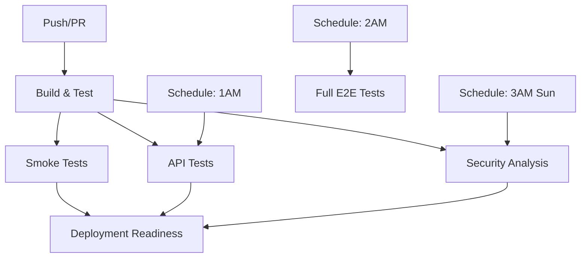

# CI/CD Pipeline Documentation

This directory contains GitHub Actions workflows for automated testing and continuous integration of the Todo List application.

## Workflows Overview

### 1. Continuous Integration (`ci.yml`)
**Triggers:** Push/PR to main/develop branches
- Builds frontend and backend
- Runs code quality checks
- Orchestrates smoke tests, API tests, and security analysis
- Provides deployment readiness assessment

### 2. Smoke Tests (`smoke-tests.yml`)
**Triggers:** Push/PR to main branch
- Runs critical E2E and API tests tagged as `smoke`
- Fast feedback for essential functionality
- Runs on every push to main branch

### 3. API Tests (`api-tests.yml`)
**Triggers:** Push/PR to backend changes, daily schedule
- Comprehensive API endpoint testing using Robot Framework
- Tests authentication, CRUD operations, validation
- Covers 7+ API endpoints with happy path and negative scenarios

### 4. E2E Tests (`e2e-tests.yml`)
**Triggers:** PR to main/develop, daily schedule, manual
- Full end-to-end testing using Robot Framework + Selenium
- Tests all user stories from registration to sharing
- Runs smoke tests on PR, full suite nightly

### 5. Security Analysis (`security-analysis.yml`)
**Triggers:** Push/PR, weekly schedule
- Dependency vulnerability scanning (Safety, NPM Audit)
- Static code analysis (Bandit, Flake8, ESLint)
- Docker image security scanning (Trivy)
- Basic performance testing (Apache Bench)

## Test Execution Strategy

### On Every Push to Main
1. **Smoke Tests** - Essential functionality verification
2. **API Tests** (smoke tagged) - Core API functionality
3. **Security Scans** - Vulnerability and code quality checks

### On Pull Requests
1. **Build and Lint** - Code quality validation
2. **Smoke Tests** - Core functionality verification
3. **Security Analysis** - Security and vulnerability assessment

### Nightly Schedules
- **1 AM UTC**: Full API test suite
- **2 AM UTC**: Full E2E test suite
- **3 AM UTC** (Sundays): Complete security analysis

## Test Coverage

### End-to-End Tests (Robot Framework + Selenium)
**User Stories Covered:**
1. ✅ User registration
2. ✅ User login/logout
3. ✅ Todo list creation and deletion
4. ✅ Todo list modification (name/description)
5. ✅ Todo item creation and deletion
6. ✅ Todo item editing
7. ✅ Todo item completion toggle
8. ✅ Todo list sharing
9. ✅ Viewing shared todo lists
10. ✅ Collaborative editing

**Test Types:**
- **Smoke Tests**: Critical happy path scenarios
- **Happy Path**: Successful operation flows
- **Negative Tests**: Error handling and validation

### API Tests (Robot Framework + RequestsLibrary)
**Endpoints Covered:**
1. `POST /api/users/` - User registration
2. `POST /api/users/login` - User authentication
3. `GET /api/users/` - User search
4. `POST /api/users/refresh-token` - Token refresh
5. `GET /api/todo-lists/` - Get user's lists
6. `POST /api/todo-lists/` - Create todo list
7. `GET /api/todo-lists/{id}` - Get specific list
8. `PUT /api/todo-lists/{id}` - Update todo list
9. `DELETE /api/todo-lists/{id}` - Delete todo list
10. `GET /api/todo-lists/{id}/todos` - Get todo items
11. `POST /api/todo-lists/{id}/todos` - Create todo item
12. `PUT /api/todo-lists/{id}/todos/{item_id}` - Update todo item
13. `DELETE /api/todo-lists/{id}/todos/{item_id}` - Delete todo item

**Test Scenarios:**
- CRUD operations for all resources
- Authentication and authorization
- Input validation and error handling
- Edge cases and boundary conditions

## Artifacts and Reports

### Test Results
- **Robot Framework Reports**: HTML reports with detailed test execution
- **Screenshots**: Captured on E2E test failures
- **XML Outputs**: For CI/CD integration and metrics

### Security Reports
- **Safety Reports**: Python dependency vulnerabilities
- **Bandit Reports**: Python security issues
- **NPM Audit**: Node.js dependency vulnerabilities
- **Trivy Reports**: Docker image vulnerabilities
- **Code Analysis**: Linting and quality metrics

### Performance Reports
- **Apache Bench Results**: Basic API performance metrics
- **Response Time Analysis**: Endpoint performance data

## Running Tests Locally

### E2E Tests
```bash
cd e2e-tests
pip install -r requirements.txt
docker compose -f ../compose.dev.yml up -d
robot --include smoke tests/
```

### API Tests
```bash
cd backend/api-tests
pip install -r requirements.txt
docker compose -f ../../compose.dev.yml up -d
robot --include smoke tests/
```

## Workflow Dependencies



## Monitoring and Maintenance

### Success Criteria
- All smoke tests must pass for deployment readiness
- API tests should maintain >95% pass rate
- Security scans should have zero high/critical vulnerabilities
- E2E tests should cover all critical user journeys

### Failure Handling
- Test failures block deployment readiness
- Artifacts preserved for debugging (30 days for tests, 7 days for screenshots)
- Notifications via GitHub checks and pull request status

### Maintenance
- Weekly review of security scan results
- Monthly update of test dependencies
- Quarterly review and update of test coverage